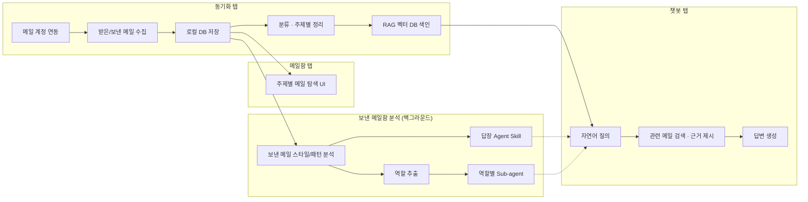

# 아키텍처

## 왜 Tauri인가

WorkTwin은 [Tauri](https://tauri.app/) 기반 데스크톱 앱으로 구상됩니다. 메일 원문·첨부·개인정보를 다루는 만큼, 웹 서비스로 만들어 서버에 데이터를 올리기보다는 **로컬 실행형 앱**으로 두는 편이 데이터 주권과 신뢰 확보에 유리합니다. Tauri는 Rust 기반의 가벼운 런타임 위에 웹 프론트엔드를 올리는 구조라, 로컬 파일 시스템·로컬 DB 접근이 자연스럽고 배포 바이너리도 가볍습니다.

## 4탭 구조

앱은 아래 4개의 탭으로 구성됩니다.

| 탭 | 역할 |
|---|---|
| **동기화 (Sync)** | 메일 계정을 연결하고, 받은/보낸 메일함을 로컬 DB로 가져와 분류·정리하고 RAG 벡터 DB에 색인 |
| **메일함 (Inbox)** | 동기화된 메일을 주제/분류별로 탐색, 원본 메일 열람 |
| **챗봇 (Chatbot)** | RAG 벡터 DB를 기반으로 메일함 전체에 대해 자연어로 검색·질의·요약 |
| **설정 (Settings)** | 계정 연결, 동기화 주기, 역할/서브에이전트 관리, 자동 답장 허용 범위 등 구성 |

## 데이터 파이프라인

전체 흐름은 "수집 → 분류 → 색인 → 활용"의 4단계로 나눌 수 있습니다.

각 구성 요소를 조금 더 풀어보면 다음과 같습니다.

- **로컬 DB**: 원본 메일과 메타데이터(발신자, 스레드, 라벨, 타임스탬프 등)를 저장하는 1차 저장소. 모든 후속 처리의 소스 오브 트루스입니다.
- **RAG 벡터 DB**: 로컬 DB의 메일 본문을 임베딩해 저장하는 검색 전용 인덱스. 챗봇 탭의 질의응답은 여기서 관련 메일을 찾아온 뒤 근거로 삼아 답을 생성하는 방식입니다.
- **보낸 메일함 분석**: 동기화와 별개로 도는 백그라운드 분석 트랙입니다. 여기서 나온 결과물이 [답장 Agent Skill](./features/auto-reply-skill.md)과 [역할별 Sub-agent](./features/role-extraction-subagents.md)입니다.

각 파이프라인 단계의 구체적인 동작은 [핵심 기능](./features/mailbox-sync-rag.md) 장에서 하나씩 다룹니다.

:::info 스케일 관점
사용자 메일함은 수 기가바이트~수십 기가바이트 규모를 가정합니다. 따라서 동기화는 전체 재처리가 아니라 **증분(incremental) 동기화**를 전제로 설계되어야 하며, 로컬 DB와 벡터 DB 모두 이 규모에서 실용적인 응답 속도를 낼 수 있어야 합니다. 구체적인 DB 엔진·임베딩 모델 선택은 아직 확정되지 않았습니다 ([로드맵](./roadmap.md) 참고).
:::
