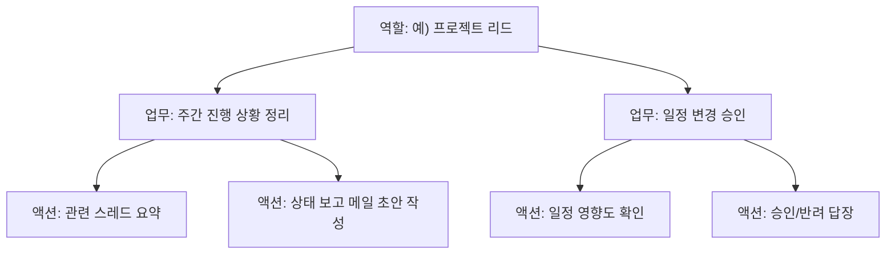

# 역할 추출과 서브에이전트

메일함을 개별 메일 단위가 아니라 **전체 흐름**으로 보면, 내가 실제로 수행해온 여러 개의 역할이 드러납니다. WorkTwin은 이 역할들을 식별하고, 역할마다 어떤 업무와 액션이 따라오는지 정리한 뒤, 각 역할을 독립된 **서브에이전트**로 승격시킵니다.

## 역할은 어떻게 드러나는가

역할은 발신자 그룹, 반복되는 주제, 사용되는 어조와 판단 기준의 조합으로 구분됩니다. 예를 들어 한 사람이 다음과 같은 서로 다른 역할을 동시에 수행하고 있을 수 있습니다.

- **프로젝트 리드**: 일정/리소스 관련 의사결정, 이해관계자 커뮤니케이션
- **코드/문서 리뷰어**: 품질 기준에 따른 피드백, 승인/반려 판단
- **벤더·파트너 커뮤니케이션 담당**: 협상, 조건 조율, 격식 있는 어조
- **팀 내 멘토/1:1 응대**: 캐주얼한 어조, 코칭 성격의 답변

이 역할들은 서로 다른 발신자 그룹, 다른 주제, 다른 판단 기준을 가지므로 메일함 데이터만으로도 군집화가 가능합니다.

## 역할 → 업무 → 액션의 계층

역할 하나는 다시 그 안에서 반복되는 **업무(task)** 로, 업무는 다시 구체적인 **액션(action)** 으로 쪼개집니다.

이 계층 구조는 [자동 답장 스킬](./auto-reply-skill.md)에서 정의한 스킬들이 어느 역할, 어느 업무에 속하는지를 연결하는 뼈대가 됩니다.

## 역할의 서브에이전트 승격

각 역할이 명확히 정의되면, 그 역할을 전담하는 서브에이전트로 승격시킬 수 있습니다. 서브에이전트는 다음을 갖습니다.

- 해당 역할에서만 쓰이는 **판단 기준과 어조**
- 해당 역할에 속한 **자동 답장 스킬** 목록
- 해당 역할과 관련된 메일만 걸러보는 **좁혀진 검색 범위** (RAG 벡터 DB 질의 시 역할 컨텍스트로 필터링)

이렇게 되면 챗봇 탭에서 "프로젝트 리드로서 이 문제 어떻게 처리했었지?"처럼 역할을 특정한 질문에도 더 정확한 답을 받을 수 있고, 자동 답장도 역할에 맞는 어조와 기준을 일관되게 적용할 수 있습니다.

## 부산물: 나의 역할 목록 그 자체

이 과정의 흥미로운 부산물은, **내가 실제로 어떤 역할들을 수행하고 있는지에 대한 목록 자체가 정리된다**는 점입니다. 스스로도 명시적으로 정리해본 적 없는 역할 구조를 메일함 데이터가 대신 드러내 주는 셈입니다.
