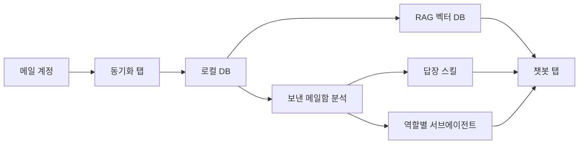

# 세미나 발표 자료: WorkTwin

이 문서는 앞선 장들의 내용을 **발표 흐름**으로 재구성한 버전입니다. 각 절을 슬라이드 한 장이라고 생각하고 순서대로 넘기면 됩니다. 굵은 소제목이 슬라이드 제목, 그 아래 본문이 슬라이드에 띄울 핵심 문구, `:::tip 발표 노트` 블록이 발표자용 부연 설명입니다.

---

## 1. 훅 — "그 메일, 다시 찾을 수 있나요?"

> 3년 전 그 프로젝트에서, 나는 그 이슈에 뭐라고 답했을까요?

대부분은 못 찾습니다. 검색창에 키워드 몇 개를 넣어보다가 포기합니다. 그런데 그 답은 분명히 **내 메일함 어딘가에** 있습니다.

:::tip 발표 노트
청중에게 실제로 "최근에 옛날 메일 찾다가 포기한 경험 있으신 분?" 하고 손을 들어보게 하면 도입이 자연스럽습니다.
:::

---

## 2. 문제 — 메일함은 자산인데, 방치되어 있다

내 이메일함에는 다음이 전부 기록되어 있습니다.

- 내가 맡아온 **역할**과 **프로젝트**
- 내가 매번 새로 만들어야 했던 **반복 답장**
- 내가 어떤 기준으로 승인/반려/리뷰했는지에 대한 **판단 이력**

문제는 이게 검색도 잘 안 되고, 활용도 안 되고, 결국 **다시 열어보지 않는 아카이브**로 끝난다는 것입니다.

:::tip 발표 노트
자세한 배경은 [배경과 문제의식](../background-motivation.md)을 참고. 여기서는 "메일함 = 방치된 자산"이라는 프레임만 명확히 전달하고 넘어갑니다.
:::

---

## 3. 개념 — WorkTwin: 메일함으로 만드는 나의 업무 쌍둥이

> WorkTwin은 내 메일함 전체를 학습해, 나를 대신해 메일 맥락을 검색·이해·응답하는 개인 전용 에이전트입니다.

세 가지 축으로 이루어집니다.

1. **아는 것** — 받은 메일함 → RAG 벡터 DB → 챗봇 검색
2. **답하는 것** — 보낸 메일함 → 답장 패턴 → 자동 답장 스킬
3. **맡은 것** — 메일함 전체 → 역할 추출 → 역할별 서브에이전트

:::tip 발표 노트
자세한 내용은 [핵심 개념](../core-concept.md). 여기서는 세 축을 손가락 세 개 세우듯 명확히 구분해서 말하면 청중이 구조를 기억하기 쉽습니다.
:::

---

## 4. 가상 시나리오 — 이런 하루라면

아직 구현되지 않은 아이디어이므로, 완성됐다고 가정했을 때의 **가상 시나리오**로 개념을 체감해봅니다.

1. 아침에 WorkTwin 챗봇에게 묻습니다. *"어제 B사에서 온 계약 조건 변경 메일, 우리 전에 비슷한 요청 받았을 때 어떻게 답했었지?"* → 챗봇이 2년 전 유사 사례 메일을 근거로 답을 정리해줍니다.
2. 정형화된 일정 조율 메일 5통이 도착합니다. WorkTwin이 학습해둔 답장 스킬이 초안을 만들어 두었고, 사용자는 확인 후 한 번에 발송합니다.
3. 설정 탭을 열어보면, WorkTwin이 메일함 분석으로 정리해준 나의 역할 목록 — "프로젝트 리드", "코드 리뷰어", "벤더 커뮤니케이션" — 이 각각 서브에이전트로 나열되어 있습니다.

:::caution 발표 노트
이 시나리오는 **가상**입니다. 발표 중 "아직 구현 전 단계이고, 이건 개념을 보여주기 위한 가상 시나리오"라는 점을 반드시 짚고 넘어가야 합니다.
:::

---

## 5. 아키텍처 요약

Tauri 기반 데스크톱 앱, 4개 탭(동기화/메일함/챗봇/설정), 로컬 DB + RAG 벡터 DB 파이프라인.

:::tip 발표 노트
자세한 구조는 [아키텍처](../architecture.md). 발표에서는 "로컬에서 다 처리된다"는 점을 강조하면 다음 슬라이드(프라이버시)로 자연스럽게 이어집니다.
:::

---

## 6. 왜 로컬 우선인가

메일함은 계약 조건, 인사 논의, 미공개 의사결정까지 담긴 가장 민감한 업무 데이터입니다. 그래서 동기화·분석·색인은 **로컬 우선**을 기본값으로 하고, 외부로 나가는 데이터가 있다면 사용자가 명확히 인지하고 통제할 수 있어야 합니다.

:::tip 발표 노트
자세한 내용과 아직 열려 있는 신뢰 질문들은 [로컬 우선·프라이버시](../privacy-local-first.md).
:::

---

## 7. 로드맵과 열린 질문

1단계(읽고 검색) → 2단계(나를 분석) → 3단계(대신 답하기) → 4단계(역할로 나뉘기) 순으로 점진적으로 나아가는 구상입니다. 동시에 "어렵지 않은 일의 기준", "역할 간 경계", "자동 발송의 신뢰 기준" 같은 질문은 아직 답이 없습니다.

:::tip 발표 노트
자세한 내용은 [로드맵](../roadmap.md). 열린 질문을 숨기지 않고 그대로 보여주는 것이 오히려 신뢰를 줍니다.
:::

---

## 8. 클로징

> 나보다 나를 잘 아는 에이전트는, 새로운 데이터가 아니라 **이미 내가 수년간 써온 메일함**에서 나올 수 있습니다.

WorkTwin은 이 메일함이라는 자산을 그대로 두지 않고, 검색 가능하게 하고, 판단 패턴을 학습하고, 역할을 구조화하는 프로젝트입니다.

:::tip 발표 노트
마지막 문장은 1번 슬라이드의 훅과 대구를 이루도록 다시 "그 메일, 다시 찾을 수 있나요?"를 언급하며 마무리하면 순환 구조로 끝맺을 수 있습니다.
:::
